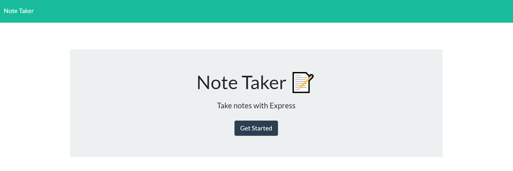

# 🏬 Note Taker

Note Taker is a web application that allows the user to add and delete random notes.
  

## 🎯 Objectives

* Use **Express.js**.
  

## 📚 _User Stories_
As a small business owner I want to . . . . . . . . | So that I may . . . . . . . . . . . . . . 
----------------------------------- | ------------------------------------------
write and save notes     | organize my thoughts and keep track of tasks
 

## 🖼️ Wireframe
 

 

  

## 📹 Video Demonstration
<video controls width="80%" align="center" src="./public/images/Note Taker.webm" type="video/webm"> 
    Sorry, your browser doesn't support embedded videos.
</video>
